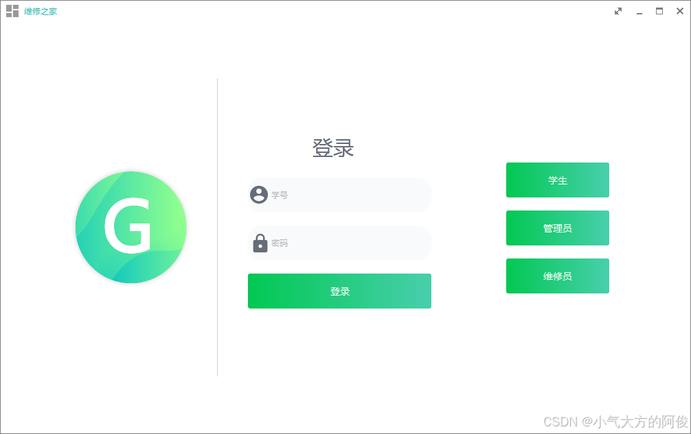
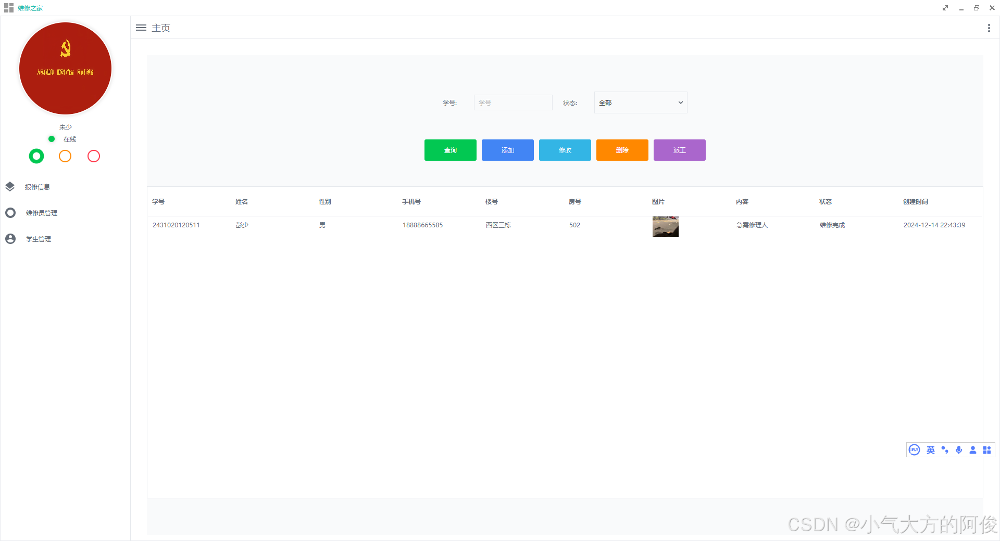
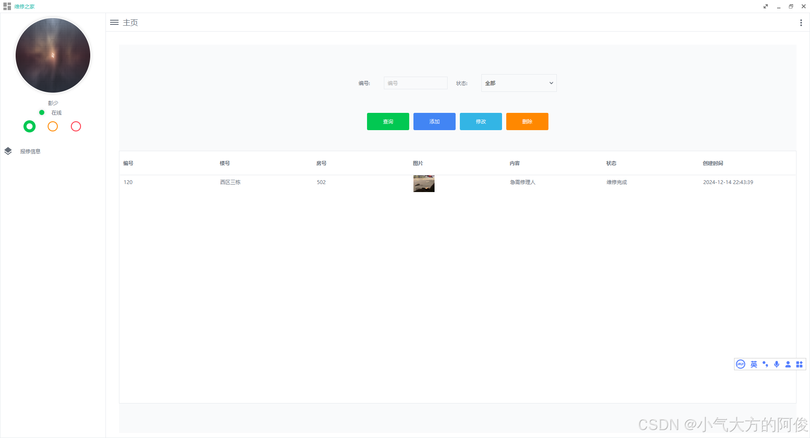
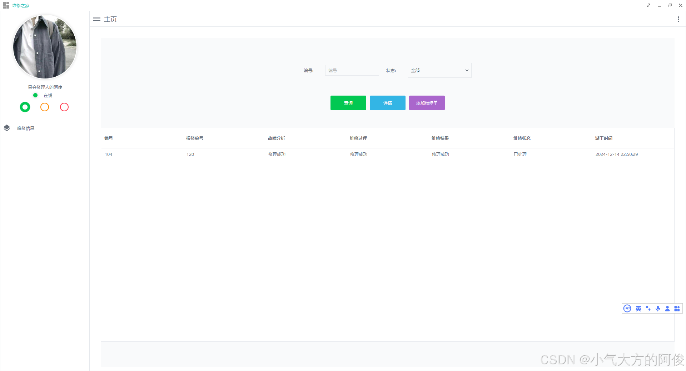

# 技术架构

## 系统概述

本系统采用JavaFX作为前端框架，Spring Boot作为后端框架，MyBatis用于数据库操作，而Bootstrap则提供了响应式UI组件。这种技术栈的选择考虑到了以下因素：

* JavaFX：为学生提供直观易用的桌面和移动应用界面。
* Spring Boot：简化后端开发，快速实现功能模块。
* MyBatis：高效处理数据库操作，确保系统性能。
* Bootstrap：提供响应式布局，确保跨平台兼容性。

# 登陆界面

# 管理员界面

# 学生界面

# 维修员界面

## 技术栈详细介绍

### JavaFX

JavaFX是一个用于构建桌面应用程序的现代化GUI工具包，主要由Sun Microsystems开发。其主要特点包括：

* 使用Java语言编写
* 提供丰富的UI组件，如按钮、文本字段等
* 支持动画效果
* 可以创建响应式用户界面
* 适用场景：开发桌面应用程序、游戏、多媒体应用等

### Spring Boot

Spring Boot是一款基于Spring框架的快速开发工具包，专注于简化企业级应用开发过程。其主要特点包括：

* 自动配置功能，减少手动配置代码
* 内置嵌入式服务器，简化部署
* 强大的依赖管理
* 支持热部署
* 适用场景：开发微服务、Web应用、企业级后端系统等

### MyBatis

MyBatis是一个开源的Java持久层框架，它提供了简单的SQL映射功能。其主要特点包括：

* 简化数据库操作，减少冗余代码
* 支持自定义SQL语句
* 提供XML或注解方式的配置
* 高性能，适合处理大量数据
* 适用场景：需要与数据库交互的Java应用程序开发

### Bootstrap

Bootstrap是一个免费的、开源的前端框架，由Twitter开发并维护。其主要特点包括：

* 提供预构建的CSS和JS组件
* 响应式设计，适配不同设备屏幕尺寸
* 简单易用的类名系统
* 社区活跃，持续更新
* 适用场景：快速开发响应式网站、Web应用的前端部分

## 技术整合

虽然这四种技术各自强大，但它们并不常常一起使用。在实际项目中，你可能会选择其中一种或几种技术来满足你的需求。例如：

* 如果你正在开发一个桌面应用，可以考虑使用JavaFX作为GUI框架。
* 对于后端开发，Spring Boot是一个很好的选择。
* 数据库操作可以使用MyBatis。
* 前端UI可以采用Bootstrap。

## 外部包
在这里需要引入开源项目的web项目包 包在项目的lib哪里 这里使用maven导入 选择自己的包路径
mvn install:install-file -DgroupId=gn -DartifactId=GNCalendar -Dversion=v1.0 -Dpackaging=jar -Dfile=E:\idea\project\Java\ServiceHomeJavaFx\lib\GNCalendar-1.0-alpha.jar

mvn install:install-file -DgroupId=gn -DartifactId=GNButton -Dversion=v1.1.0 -Dpackaging=jar -Dfile=E:\idea\project\Java\ServiceHomeJavaFx\lib\GNButton-1.1.0.jar

mvn install:install-file -DgroupId=gn -DartifactId=GNCarousel -Dversion=v2.1.5 -Dpackaging=jar -Dfile=E:\idea\project\Java\ServiceHomeJavaFx\lib\GNCarousel-2.1.5.jar

mvn install:install-file -DgroupId=gn -DartifactId=GNDecorator -Dversion=v2.1.2-alpha -Dpackaging=jar -Dfile=E:\idea\project\Java\ServiceHomeJavaFx\lib\GNDecorator-2.1.2-alpha.jar

mvn install:install-file -DgroupId=gn -DartifactId=GNAvatarView -Dversion=v1.0-rc -Dpackaging=jar -Dfile=E:\idea\project\Java\ServiceHomeJavaFx\lib\GNAvatarView-1.0-rc.jar

